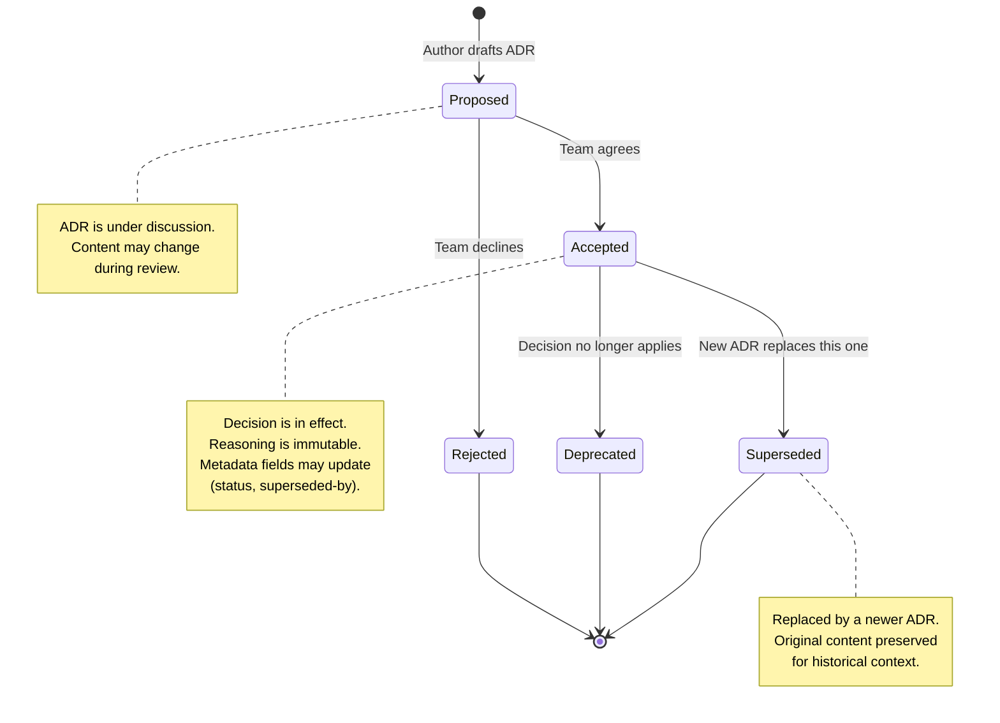

# ADR Guide: Effective Use from Start to Finish

## Overview

This guide covers the full ADR lifecycle — from recognizing when a decision needs recording through post-acceptance implementation and eventual supersession. It serves as a reference for teams adopting ADRs and for the agent when advising users on ADR practices.

## When to Write an ADR

### Write an ADR when

- **The decision involves a trade-off.** If choosing Option A means giving up a benefit of Option B, the trade-off reasoning must be preserved. Future readers will ask "why didn't we choose B?" — the ADR answers that question.
- **The decision is hard to reverse.** Technology choices, data store selections, architectural patterns, API contracts, and protocol choices become load-bearing over time. Record the reasoning before it becomes folklore.
- **The decision crosses team boundaries.** When a choice affects multiple teams, services, or repositories, the rationale must be accessible to everyone impacted — not trapped in one team's Slack channel.
- **Someone will ask "why?" within 6 months.** If you can predict the question, answer it now while the context is fresh.
- **The decision resolves a genuine debate.** When reasonable people disagreed, the ADR records the resolution and the reasoning — preventing the debate from recurring.

### Skip the ADR when

- **No alternatives exist.** If a regulatory requirement mandates a specific approach, document it as a requirement — not a decision. ADRs are for choices.
- **The decision is trivially reversible.** Choosing a variable name, picking a color for a button, or selecting a local development tool rarely warrants an ADR. If changing the decision costs less than writing the ADR, skip it.
- **The decision is forced by a dependency.** If your framework requires a specific ORM, that is a consequence of the framework choice (which may deserve its own ADR) — not an independent decision.
- **The decision is temporary and acknowledged.** A clearly-marked workaround with a TODO and a timeline does not need an ADR. But if the "temporary" workaround survives past its deadline, consider writing one.

### Gray areas

- **"Obvious" decisions.** A choice that seems obvious today may confuse a new team member in a year. If the "why" is not self-evident from the code, write an ADR. Err on the side of recording.
- **Incremental decisions.** A series of small, related choices can accumulate into an architectural pattern. If you notice a pattern forming, write one ADR that captures the pattern rather than one per small choice.

## Scoping an ADR

Each ADR addresses exactly one decision. Scope violations are the most common source of ADR dysfunction.

### Signs an ADR needs splitting

- The title contains "and" — e.g., "Use PostgreSQL and Redis." These are two independent decisions with different trade-offs. Write two ADRs.
- Different decision-makers are responsible for different parts of the ADR.
- The consequences section lists trade-offs that apply to unrelated aspects of the system.
- The considered options cannot be meaningfully compared because they address different concerns.

### Signs multiple ADRs should be merged

- Two ADRs address the exact same decision from different angles (e.g., "Use React" and "Adopt component-based UI architecture" where React was chosen specifically because it is component-based).
- One ADR's Decision Outcome makes the other ADR's decision automatic — they are not independent choices.

### Stating scope within the ADR

The Context and Problem Statement section MUST make scope explicit. Name:

- Which services, components, or modules are affected
- Which system boundaries the decision operates within
- Which teams or codebases are impacted
- What is explicitly outside the decision's scope (when ambiguity is likely)

## Post-Hoc ADRs

Post-hoc ADRs document decisions that were already made and implemented without a formal record. They are less ideal than upfront ADRs but far more valuable than no record at all.

### When to write post-hoc ADRs

- A new team member asks "why did we choose X?" and nobody can answer confidently
- An architectural review reveals undocumented load-bearing decisions
- A team is evaluating whether to change a technology and needs to understand the original constraints
- During onboarding preparation, when implicit knowledge needs to become explicit

### How to write honest post-hoc ADRs

- **State in the Context section that this is a post-hoc record.** Example: "This ADR was written in March 2025 to document a decision made in approximately June 2024. The rationale below reflects our best reconstruction of the original reasoning."
- **Do not fabricate formality.** If the decision was made informally (a Slack conversation, a hallway discussion), say so. Do not pretend there was a structured evaluation process if there was not.
- **Reconstruct, do not invent.** Interview the original decision-makers if possible. Check commit messages, PR descriptions, and Slack archives for contemporaneous reasoning. Document what you find, flag what you are uncertain about.
- **Mark reconstructed rationale explicitly.** Use phrasing like "Based on commit history and discussion with [Name], the primary drivers appear to have been..." This signals that the rationale is reconstructed, not original.

## The ADR Lifecycle

### Status transitions



**Key rule:** Once an ADR reaches `accepted`, its content is immutable. Only the `status`, `superseded-by`, and `informed` frontmatter fields may be updated. If the decision needs to change, write a new ADR that supersedes this one.

### Phase 1: Proposal

1. **Author drafts the ADR** with status `proposed`. The draft includes research, alternatives, and a recommended option.
2. **Circulate for review.** Submit the ADR as a pull request or share via the team's review channel. The review focuses on:
    - Are the decision drivers accurate and complete?
    - Are there missing alternatives the team should consider?
    - Are consequences honestly stated?
    - Does the team agree with the recommended option?
3. **Discuss and refine.** The ADR is a living draft during this phase. Incorporate feedback, add missing perspectives, strengthen weak sections.

### Phase 2: Agreement

1. **The team reaches agreement.** Agreement does not require unanimity — it requires that all decision-makers have reviewed the ADR, concerns have been heard and addressed, and the team is willing to commit to the decision. Document the agreement mechanism:
    - PR approval from all decision-makers
    - Explicit sign-off in a meeting (note the date and attendees)
    - Written confirmation in the review channel
2. **Update status to `accepted`.** Merge the ADR PR. The accepted ADR is now the authoritative record of the decision.

### Phase 3: Implementation

1. **Link implementing work to the ADR.** Reference the ADR number in:
    - Commit messages: `Implements ADR-0015`
    - PR descriptions: `This PR implements the async processing pattern described in ADR-0015`
    - Issue/ticket tracking: Link the ADR to the implementing epic or story
2. **Verify compliance.** Use the Confirmation section's verification approach:
    - If automated: Ensure the CI check or linter rule is active
    - If manual: Schedule the first review
    - If code review: Add the check to the team's review checklist

### Phase 4: Codification (when practical)

Codification means encoding the decision into automated enforcement so compliance does not depend on human memory.

1. **Identify codifiable aspects.** Not every decision can be automated, but many can:

    | Decision type | Codification approach |
    | --- | --- |
    | "Use library X, not Y" | Dependency linter rule, banned-import check |
    | "All APIs must use pagination" | API linter, contract test |
    | "Database migrations must be backward-compatible" | Schema migration CI check |
    | "Services communicate via message queue, not direct HTTP" | Architecture fitness function, import restrictions |
    | "All public APIs require authentication" | Security scanner, integration test |

2. **Implement enforcement gradually.** Start with warnings in code review, then add linter rules, then add CI gates. This prevents a disruptive rollout.

3. **Reference the ADR from the enforcement tool's configuration.** When a developer triggers a lint violation, they should be able to trace it back to the ADR that explains why the rule exists.

### Phase 5: Re-evaluation

1. **Monitor re-evaluation triggers.** The "Re-evaluate when" field in the More Information section defines specific conditions. Check these triggers periodically:
    - Traffic or scale thresholds exceeded
    - Team composition changed significantly
    - New technology options became available
    - Original constraints no longer apply
    - The decision is causing repeated friction

2. **When a trigger fires, write a new ADR — do not modify the old one.** The original ADR remains an accurate historical record. The new ADR:
    - References the original: `supersedes: [ADR-0015]`
    - Explains what changed since the original decision
    - Evaluates the current options (which may include the original choice)
    - Updates the original ADR's frontmatter: `superseded-by: [ADR-0047]`

## File Naming and Organization

### File naming

Pattern: `NNNN-title-with-dashes.md`

- `NNNN`: 4-digit zero-padded sequential number (0001, 0002, ..., 0123)
- `title-with-dashes`: Lowercase, hyphen-separated, derived from the ADR title
- Zero-padding ensures correct lexicographic sorting (0001 before 0010)

Examples:

- `0001-use-postgresql-for-transactional-storage.md`
- `0015-adopt-event-driven-order-processing.md`
- `0023-replace-custom-auth-with-auth0.md`

### Directory placement

Store ADRs in the project's documentation directory. The default path is `docs/decisions/`. Common alternatives include `docs/adr/` and `docs/adrs/`.

```text
project-root/
└── docs/
    └── decisions/
        ├── 0001-use-postgresql-for-transactional-storage.md
        ├── 0002-adopt-microservices-for-order-domain.md
        ├── 0003-use-react-for-customer-portal.md
        └── ...
```

For monorepos or large projects with domain-specific decisions, use subdirectories:

```text
project-root/
└── docs/
    └── decisions/
        ├── platform/
        │   ├── 0001-kubernetes-for-orchestration.md
        │   └── 0002-datadog-for-observability.md
        ├── backend/
        │   ├── 0001-use-postgresql.md
        │   └── 0002-event-driven-processing.md
        └── frontend/
            ├── 0001-use-react.md
            └── 0002-state-management-with-zustand.md
```

Within subdirectories, each domain maintains its own sequential numbering.

### ADR index

For directories with more than ~15 ADRs, maintain a `README.md` in the decisions directory listing all ADRs with their number, title, and current status. This provides at-a-glance navigation and helps readers identify which decisions are current vs. superseded or deprecated.

### Linking between ADRs

Use relative links within the repository. In the More Information section:

```markdown
- **Related ADRs**: [ADR-0012: Adopt event-driven messaging](0012-adopt-event-driven-messaging.md)
- **Supersedes**: [ADR-0003: Use RabbitMQ for async processing](0003-use-rabbitmq-for-async-processing.md)
```

## Team Collaboration Patterns

### ADRs as pull requests

Submitting ADRs as PRs leverages the team's existing code review infrastructure:

- **Discussion is threaded and preserved.** PR comments become part of the decision's history.
- **Approval is explicit.** Reviewers approve or request changes, creating a clear record of agreement.
- **Changes are tracked.** The PR diff shows how the ADR evolved during review.
- **Integration is natural.** Developers already review PRs daily; ADR reviews fit the existing workflow.

### Onboarding with ADRs

ADRs are one of the highest-value onboarding artifacts a team can maintain:

- New team members read ADRs chronologically to understand how the architecture evolved
- The "Context and Problem Statement" sections explain the system's history in decision-sized chunks
- The "Considered Options" sections answer the inevitable "why didn't we use X?" questions before they are asked
- The "Re-evaluate when" fields help new members understand which decisions are firm and which might change

### Resolving disagreement

When the team cannot reach agreement on a proposed ADR:

1. **Ensure all alternatives are documented.** Often, disagreement stems from an undocumented option.
2. **Separate facts from preferences.** Decision drivers should be factual constraints. If a "driver" is actually a preference, label it as such.
3. **Time-box the discussion.** Set a deadline for the decision. Indecision has a cost — document it as a consequence of delay.
4. **Escalate with context.** If the decision must be escalated, the ADR provides the escalation artifact — the decision-maker receives a structured summary, not a verbal retelling.
5. **Record the dissent.** If a decision-maker disagrees but the team proceeds, note the dissent in the More Information section. This is not political — it records that the trade-off was acknowledged, not overlooked.

## ADRs and Governance

### What ADRs are

ADRs are **records of decisions and their rationale**. They capture why a choice was made, what alternatives were considered, and what trade-offs were accepted. Their primary value is preserving context for future readers — not enforcing compliance.

### What ADRs are not

ADRs are not policy documents, mandates, or compliance artifacts. An ADR that says "Use PostgreSQL for transactional storage" is a record of a decision the team made — it is not a rule that PostgreSQL must be used. The distinction matters because:

- **Records invite re-evaluation.** When circumstances change, the ADR's re-evaluation triggers and documented rationale help teams decide whether to supersede the decision. This is healthy.
- **Mandates resist re-evaluation.** Governance documents create bureaucratic friction around change. When an ADR is treated as a mandate, teams must fight the governance process instead of engaging with the technical merits.

### Team-level ADRs

At the team level, ADRs function as **shared memory**. They are:

- A reference for current team members ("why did we choose this?")
- An onboarding tool for new members ("how did this architecture evolve?")
- A re-litigation shield ("we already evaluated that option — here's why we didn't choose it")
- A decision journal that builds institutional knowledge over time

Teams should not treat their own ADRs as governance. A team that cannot change its own past decisions without a formal governance process has created unnecessary overhead. The ADR lifecycle (propose → accept → supersede) already provides a structured path for changing decisions.

### Platform and enterprise-level ADRs

At the platform or enterprise architecture level, ADRs take on a **governance-adjacent role** because the decisions they record constrain downstream teams. An enterprise ADR stating "All customer-facing services must use the approved API gateway" effectively functions as a policy.

However, even at this level, the ADR itself remains a record — not the enforcement mechanism:

- **The ADR captures the reasoning.** It explains *why* the API gateway is required (security, observability, rate limiting), what alternatives were evaluated, and what trade-offs were accepted.
- **Enforcement belongs to tooling.** CI checks, architectural fitness functions, compliance scanners, and code review checklists enforce the decision. These tools should reference the ADR number so developers can understand the reasoning behind the constraint.
- **The ADR enables principled challenge.** A downstream team that disagrees with the enterprise decision can read the ADR, understand the original constraints, and propose a superseding ADR if circumstances have changed. This is healthier than challenging an opaque policy.

### Practical guidance

| Level | ADR role | Enforcement mechanism | Change process |
| --- | --- | --- | --- |
| Team | Shared memory and decision journal | Team norms, code review | Team proposes superseding ADR |
| Platform | Decision record with cross-team impact | CI checks, linter rules, fitness functions | Architecture review board or equivalent evaluates superseding ADR |
| Enterprise | Decision record with org-wide impact | Compliance scanners, gateway policies, audit | Enterprise architecture review evaluates superseding ADR |

At every level, the ADR is the *justification*, not the *rule*. When a developer encounters a lint violation or a blocked deployment, the ADR answers "why does this rule exist?" — which is more useful than "this is the rule."

### Compliance-adjacent ADRs (SOC 2, HIPAA, PCI, etc.)

Regulated environments often need decisions tied to compliance requirements. ADRs can serve this purpose:

- **Reference the compliance requirement explicitly** in the Decision Drivers section (e.g., "PCI DSS Requirement 3.4: Render PAN unreadable anywhere it is stored").
- **Link ADRs to compliance controls** in the More Information section so auditors can trace from requirement to decision to implementation.
- **Use the Confirmation section** to specify the audit mechanism — automated compliance scans, manual audit schedules, or monitoring dashboards.
- **Do not embed compliance policy in the ADR itself.** The ADR records the *decision made in response to* a compliance requirement. The requirement itself belongs in the compliance documentation.
- **Enterprise-level compliance ADRs** may warrant a longer review cycle and broader `consulted` list including security, legal, and compliance teams.

## Emergency and Incident ADRs

Some architectural decisions are made under crisis conditions — production incidents, security vulnerabilities, or urgent deadline pressure. These decisions still benefit from ADRs, but the process adapts.

### During the emergency

Focus on resolution, not documentation. Capture the minimum needed to reconstruct the decision later:

- The decision made and the primary reason ("switched to fallback DB because primary was corrupted")
- Who made the decision and when
- What alternatives were considered, even briefly

A Slack message, incident channel log, or meeting note is sufficient during the crisis.

### After the emergency (within 1 week)

Write a post-hoc ADR documenting the decision properly. The Context section should describe the emergency conditions:

> "During the P1 incident on 2025-01-15 (payment processing outage lasting 4 hours), the on-call team decided to [decision]. This ADR was written on 2025-01-20 to formally document the decision and its implications."

Include whether the emergency decision should become permanent. If the decision was a temporary workaround, state the re-evaluation trigger clearly (e.g., "re-evaluate within 30 days of incident resolution").

Link the emergency ADR to the incident postmortem in the More Information section, and link the postmortem back to the ADR. This creates a bidirectional trace between the incident record and the architectural decision it produced.

## ADR Debt and Triage

Most teams that adopt ADRs have a backlog of undocumented decisions. Prioritize retroactive documentation:

### Priority 1: Currently-questioned decisions

Decisions that team members are actively debating or confused about. These have immediate value — the ADR resolves the ambiguity now.

### Priority 2: Load-bearing decisions

Decisions embedded deep in the architecture that would be expensive to change. Even if nobody is questioning them today, documenting the rationale prevents costly mistakes when they eventually are questioned.

### Priority 3: Recent decisions

Decisions made in the last 3–6 months while context is still fresh and the original decision-makers are available.

### Priority 4: Stable, well-understood decisions

Decisions that the team understands and does not question. These have the least urgency — write them during quiet periods or as part of onboarding documentation.

### Triage workflow

1. List all undocumented architectural decisions the team can identify (brainstorm session, codebase review, or architecture diagram walkthrough)
2. Categorize each by the priority levels above
3. Assign Priority 1 decisions to be documented within the current sprint
4. Schedule Priority 2–3 decisions across subsequent sprints
5. Document Priority 4 decisions opportunistically

## The Advice Process

The Advice Process (originating from organizational design practices, adapted for software architecture by Andrew Harmel-Law) is a lightweight governance model that works well with ADRs. Instead of requiring committee approval, the Advice Process states:

> Before making a decision, the decision-maker must seek advice from (1) those who will be directly affected by the decision and (2) those with relevant expertise.

The decision-maker is not required to *follow* the advice — only to *seek* it. This preserves velocity while ensuring relevant perspectives are heard.

### How this maps to ADR fields

- **Decision-makers**: The person(s) who sought advice and made the final call
- **Consulted**: The people whose advice was sought (affected parties + domain experts)
- **Informed**: People notified after the decision was made

### When to use the Advice Process with ADRs

- Team-level ADRs: Default to the Advice Process. The author consults affected teammates and domain experts, then makes the call.
- Platform-level ADRs: Use the Advice Process but require that the `consulted` list explicitly includes representatives from each affected team.
- Enterprise-level ADRs: The Advice Process may supplement (not replace) formal architecture review. The ADR author consults widely before presenting to the review board.

## Active Referencing

An ADR that exists but is never referenced is invisible. Active referencing is the practice of linking ADRs into the team's daily workflow so they remain part of the living knowledge base.

### Where to reference ADRs

- **Code comments**: Near architectural boundaries or non-obvious design choices — `// See ADR-0015 for async processing rationale`
- **PR descriptions**: When a PR implements or relates to an ADR — "Implements ADR-0015" or "Relates to ADR-0023"
- **Commit messages**: For commits that directly implement an ADR decision
- **Code review**: When reviewing code that touches an ADR-governed area — "Does this change align with ADR-0015?"
- **Onboarding checklists**: Include "Read ADRs in `docs/decisions/`" as an explicit onboarding step
- **Incident postmortems**: Reference relevant ADRs to show whether the architecture behaved as the original decision intended
- **Linter and CI rule documentation**: Link the enforcement rule back to the ADR that justifies it

### ADRs as AI assistant context

Well-documented ADRs help AI coding assistants (including Copilot) understand architectural constraints. When ADRs are present in the repository, AI assistants can:

- Avoid suggesting approaches that violate established decisions
- Understand *why* the codebase uses certain patterns
- Propose changes that are consistent with the documented architecture
- Reference ADRs when explaining code or suggesting alternatives

For this to work, ADRs must be specific enough that an AI can extract actionable constraints from them. Vague ADRs provide no value to AI assistants.

## Common Pitfalls

### Pitfall: ADRs become bureaucratic overhead

**Symptom:** The team writes ADRs for everything, including trivial decisions. ADR creation becomes a bottleneck.

**Fix:** Apply the "when to write" criteria strictly. Not every decision is architectural. Use the minimal template variant for low-impact decisions. If an ADR takes longer to write than the decision took to make, the decision probably did not need an ADR.

### Pitfall: ADRs are written but never read

**Symptom:** ADRs exist in a directory nobody visits. New team members do not know they exist.

**Fix:** Reference ADRs actively: in PR reviews ("this relates to ADR-0015"), in onboarding checklists, in code comments near affected areas (`// See ADR-0023 for why this is async`). ADRs that are not referenced are invisible.

### Pitfall: Post-hoc rationalization

**Symptom:** ADRs are written after implementation to justify decisions already made. The "alternatives" section contains strawmen that were never seriously considered.

**Fix:** Write ADRs during the design phase, before implementation begins. If writing post-hoc, be honest about it (see Post-Hoc ADRs section). A post-hoc ADR that honestly says "we chose X without formal evaluation because of time pressure" is more valuable than one that fabricates a structured process.

### Pitfall: Stale status

**Symptom:** Superseded ADRs still show `accepted` status. Teams follow outdated decisions.

**Fix:** When creating a new ADR that supersedes an old one, update the old ADR's frontmatter in the same PR. Make status updates part of the supersession workflow, not a separate task that gets forgotten.

### Pitfall: Decision drivers are too vague to differentiate options

**Symptom:** Decision drivers like "scalability" and "maintainability" appear in every ADR but do not help distinguish between options.

**Fix:** Make drivers specific and falsifiable. "Scalability" becomes "must handle 10K concurrent connections on a single node." "Maintainability" becomes "a mid-level engineer must be able to modify the payment flow without understanding the notification system." Drivers that do not differentiate options are not drivers — they are wishes.

### Pitfall: Only the "winner" is documented

**Symptom:** The ADR describes the chosen option in detail but lists alternatives as one-word bullets with no analysis.

**Fix:** Document each alternative with enough detail that a reader can understand why it was rejected. At minimum: a 1–2 sentence description and at least one specific reason for rejection tied to a decision driver. The alternatives section is often the most valuable part of an ADR — it prevents future re-litigation.

## Quick Reference: ADR Lifecycle Checklist

| Phase | Action | Who |
| --- | --- | --- |
| Identify | Recognize that a significant decision is being made | Any team member |
| Draft | Write ADR with research, alternatives, recommendation | Author (often with agent assistance) |
| Review | Circulate as PR; team reviews drivers, options, trade-offs | Decision-makers and consulted parties |
| Agree | Decision-makers approve; status changes to `accepted` | Decision-makers |
| Implement | Code the decision; reference ADR in commits and PRs | Implementing engineers |
| Codify | Encode decision into automated enforcement where practical | Platform/DevEx team |
| Monitor | Watch for re-evaluation triggers defined in the ADR | Team lead or architect |
| Supersede | Write new ADR when triggers fire; update predecessor status | Author of new ADR |
