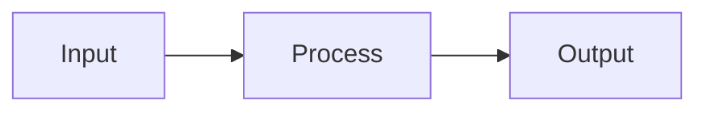
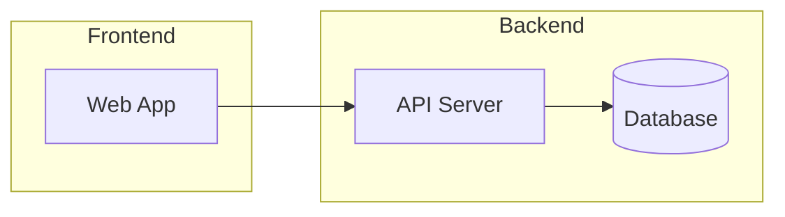

# Mermaid Diagrams

## Objective

Produce correct, readable Mermaid diagrams that render identically on GitHub, GitLab, and local tooling. Diagrams should be focused (one concept per diagram), use descriptive labels, and avoid known syntax pitfalls that cause silent rendering failures.

## Scope

**In-scope:**

- All Mermaid diagram types and their syntax
- Diagram selection guidance (which type for which purpose)
- Syntax rules, edge cases, and common pitfalls
- GitHub rendering compatibility
- Image export via the bundled CLI script
- Embedding diagrams in Markdown documentation

**Out-of-scope:**

- Mermaid.js library internals or custom plugin development
- Non-Mermaid diagramming tools (PlantUML, D2, Graphviz)
- Static site generator integration or theming

## Diagram Type Selection

Choose the diagram type that best matches the concept being visualized.

| Diagram type | Keyword | Use for |
| --- | --- | --- |
| Flowchart | `flowchart` | Process flows, decision trees, algorithms, pipelines |
| Sequence | `sequenceDiagram` | API calls, request/response flows, protocol handshakes |
| Class | `classDiagram` | OOP class hierarchies, interface relationships |
| State | `stateDiagram-v2` | State machines, object lifecycles, feature flags |
| Entity Relationship | `erDiagram` | Database schemas, data model relationships |
| Gantt | `gantt` | Project schedules, timeline planning |
| Pie | `pie` | Proportional breakdowns, usage shares |
| Mindmap | `mindmap` | Brainstorming, topic hierarchies, concept maps |
| Timeline | `timeline` | Chronological events, milestones, release history |
| Gitgraph | `gitGraph` | Branch strategies, merge workflows |
| Quadrant | `quadrantChart` | Priority matrices, risk assessment, categorization |
| Sankey | `sankey-beta` | Flow quantities, resource allocation, energy diagrams |
| XY Chart | `xychart-beta` | Line/bar charts with numeric axes |
| Block | `block-beta` | System block diagrams, architecture boxes |
| Architecture | `architecture-beta` | Cloud architecture, service topology |
| Packet | `packet-beta` | Network packet structure, protocol headers |
| Requirement | `requirementDiagram` | Requirements traceability |
| Kanban | `kanban` | Task boards, workflow stages |

Types marked `beta` may have evolving syntax. Test rendering on your target platform before committing.

## Syntax Fundamentals

### Embedding in Markdown

Open a fenced code block with the `mermaid` language identifier:

````markdown

````

### Direction

Flowcharts and block diagrams accept a direction keyword after the diagram type:

| Direction | Meaning |
| --- | --- |
| `TD` or `TB` | Top to bottom |
| `LR` | Left to right |
| `BT` | Bottom to top |
| `RL` | Right to left |

Prefer `LR` for pipelines and data flows. Use `TD` for hierarchies and trees.

### Node Shapes

```text
A[Rectangle]     A(Rounded)       A([Stadium])
A[[Subroutine]]  A[(Cylinder)]    A((Circle))
A{Diamond}       A{{Hexagon}}     A[/Parallelogram/]
A[\Parallelogram\]  A[/Trapezoid\]  A[\Trapezoid/]
```

### Edge Syntax

```text
A --> B          Solid arrow
A --- B          Solid line (no arrow)
A -.-> B         Dotted arrow
A -.- B          Dotted line
A ==> B          Thick arrow
A == text ==> B  Thick arrow with label
A -- text --> B  Solid arrow with label
```

Place each edge on its own line for readability and reliable parsing.

### Subgraphs



Rules:

- `subgraph Name` and `end` must each be on their own line.
- To use spaces in a display name: `subgraph build_pipeline [Build Pipeline]`.
- Keep nesting shallow (max 2 levels) for reliable GitHub rendering.

## Pitfalls and Issues to Avoid

### Special Characters in Labels

- Wrap labels containing special characters in double quotes: `A["100% Complete"]`.
- Avoid smart quotes (`""`), em dashes (`—`), and Unicode arrows (`→`). Use ASCII equivalents.
- Node IDs must be alphanumeric or use underscores. No spaces or hyphens in IDs.
- Parentheses, brackets, and braces in label text can break parsing. Quote the label.

### Text Wrapping

Mermaid does not auto-wrap text inside nodes. For multi-line labels, use `<br/>`:

```text
A["Line one<br/>Line two<br/>Line three"]
```

### Diagram Size

- Keep diagrams under 15 nodes. Larger diagrams become unreadable and slow to render.
- Split complex systems into multiple focused diagrams rather than one monolithic diagram.
- Add a brief text description before or after the diagram for accessibility.

### GitHub Rendering Differences

- GitHub may run an older Mermaid version than the latest release. Beta features (`sankey-beta`, `xychart-beta`, `architecture-beta`) may not render.
- GitHub strips custom CSS and restricts theme variables. Do not rely on `themeVariables` or `%%{init:}%%` directives for GitHub-hosted documentation.
- Always preview diagrams on GitHub after pushing. The Mermaid Live Editor may render syntax that GitHub rejects.

### Arrow and Syntax Errors

- Do not use Unicode arrows (`→`, `⇒`). Use only ASCII arrow syntax (`-->`, `==>`, `-.->`)
- Place one statement per line. Multiple edges on a single line may fail to parse.
- Semicolons as statement terminators are supported but discouraged — use line breaks instead.
- Comments use `%%` prefix: `%% This is a comment`.

### Theme Compatibility

- Use built-in themes only: `default`, `dark`, `forest`, `neutral`.
- Custom colors via `themeVariables` are not portable across all renderers.
- For image export, specify the theme via the CLI's `--theme` flag rather than embedding `%%{init:}%%` directives.

## Image Export

Use the bundled CLI script to convert `.mmd` files or Markdown-embedded diagrams to PNG, SVG, or PDF.

See the [Related Files](#related-files) section for the script location and usage.

### Quick Export

```bash
# Single file
node scripts/mermaid-export.mjs input.mmd output.png

# With options
node scripts/mermaid-export.mjs input.mmd output.svg --theme dark --background transparent

# From a Markdown file (extracts all mermaid blocks)
node scripts/mermaid-export.mjs README.md output-dir/ --format png
```

The script delegates to `@mermaid-js/mermaid-cli` (mmdc) and handles dependency installation automatically. See the script header for full option documentation.

## Official Documentation

| Resource | URL |
| --- | --- |
| Mermaid syntax reference | <https://mermaid.js.org/intro/syntax-reference.html> |
| Mermaid Live Editor | <https://mermaid.live/> |
| GitHub Mermaid support | <https://github.blog/developer-skills/github/include-diagrams-markdown-files-mermaid/> |
| Mermaid CLI (mmdc) | <https://github.com/mermaid-js/mermaid-cli> |
| Diagram type documentation | <https://mermaid.js.org/syntax/flowchart.html> (replace `flowchart` with diagram type) |

## Related Files

- `scripts/mermaid-export.mjs`: CLI script for converting Mermaid diagrams to PNG, SVG, or PDF images. Wraps `@mermaid-js/mermaid-cli` with automatic dependency management.
- `references/diagram-types.md`: Detailed syntax reference for each diagram type with annotated examples.

## Constraints

**MUST:**

- Use the `mermaid` language identifier on all Mermaid code fences.
- Keep diagrams under 15 nodes. Split larger concepts across multiple diagrams.
- Use descriptive node labels, not single letters (`Auth Service` not `A`).
- Use ASCII-only characters in node IDs and arrow syntax.
- Quote labels that contain special characters.
- Include a text description near each diagram for accessibility.
- Test diagram rendering on the target platform (especially GitHub) before committing.

**MUST NOT:**

- Use Unicode arrows, smart quotes, or em dashes in diagram syntax.
- Rely on `%%{init:}%%` theme directives for GitHub-hosted documentation.
- Embed more than one concept per diagram.
- Use deeply nested subgraphs (more than 2 levels).
- Place multiple edge statements on a single line.

**MAY:**

- Use `%%{init:}%%` directives for documentation rendered by local or self-hosted tools.
- Use beta diagram types when the target platform supports them.
- Export diagrams to images for platforms that do not support native Mermaid rendering.
