# Diagram Type Reference

Annotated syntax examples for each Mermaid diagram type. For diagram selection guidance, see [SKILL.md](../SKILL.md).

## Flowchart

Process flows, decision trees, and algorithms.

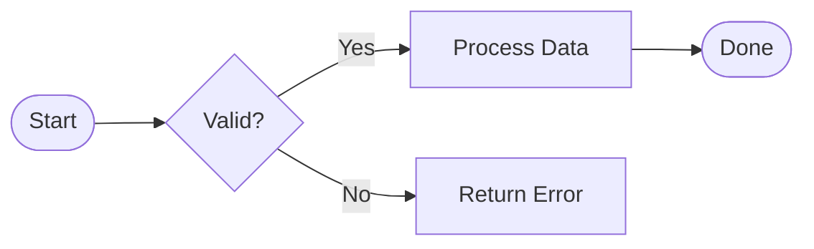

Key syntax:

- Direction after `flowchart`: `LR`, `TD`, `BT`, `RL`
- Edge labels: `-->|label|`
- Node shapes: `[]` rectangle, `{}` diamond, `([])` stadium, `(())` circle

## Sequence Diagram

API calls, message exchanges, and protocol flows.

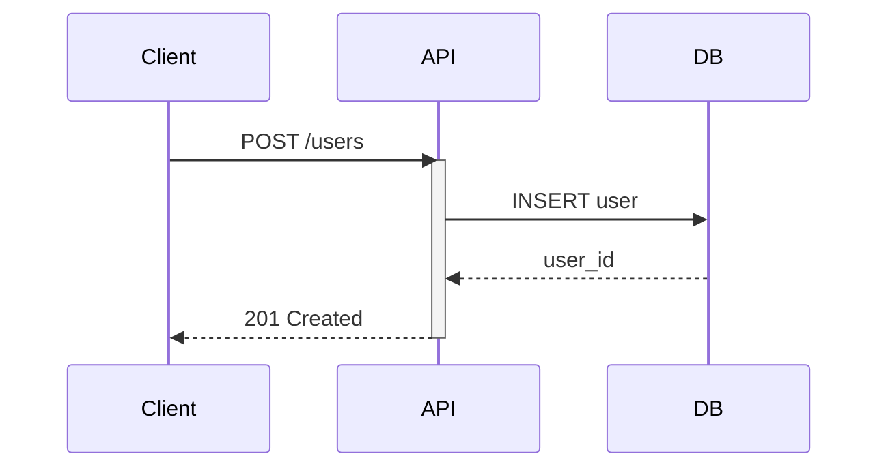

Key syntax:

- `->>` solid arrow, `-->>` dashed reply
- `activate`/`deactivate` for lifeline bars
- `participant` declares ordering; `actor` shows a person icon
- `Note over A,B: text` for spanning notes

## Class Diagram

OOP hierarchies, interfaces, and relationships.

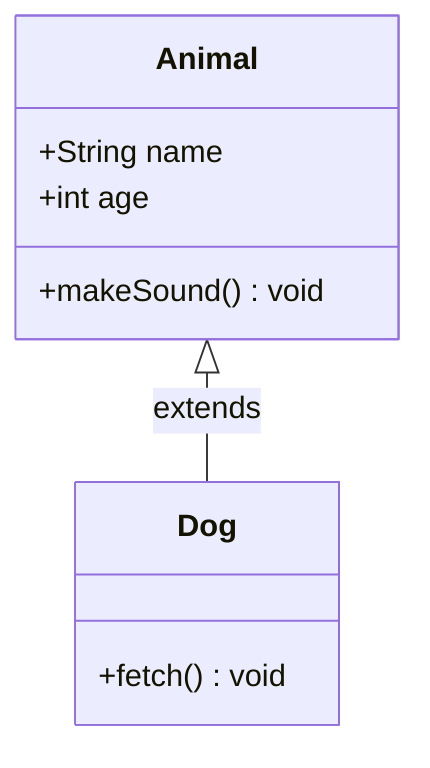

Key syntax:

- `<|--` inheritance, `*--` composition, `o--` aggregation
- Visibility: `+` public, `-` private, `#` protected, `~` package
- `<<interface>>` and `<<abstract>>` annotations

## State Diagram

State machines, object lifecycles, and workflow states.

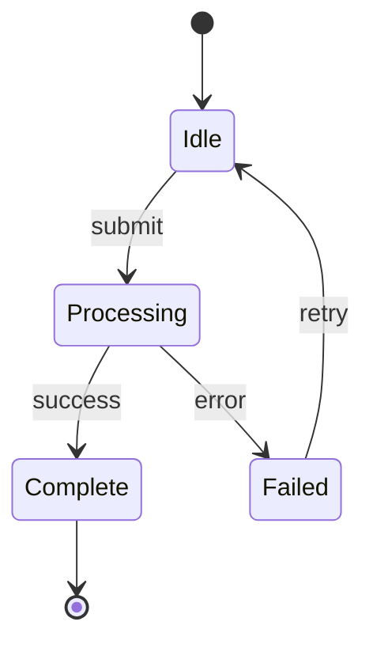

Key syntax:

- `[*]` for start and end states
- `-->` transitions with optional `: event` labels
- `state "Display Name" as s1` for aliased states

## Entity Relationship Diagram

Database schemas and data model relationships.

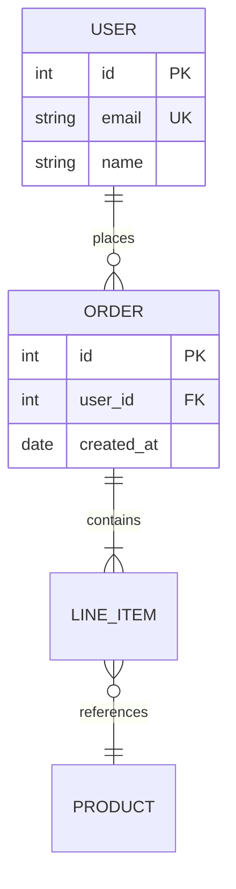

Key syntax:

- Cardinality: `||` exactly one, `o|` zero or one, `}|` one or more, `}o` zero or more
- Attributes: `type name [PK|FK|UK]`

## Gantt Chart

Project schedules and timeline planning.

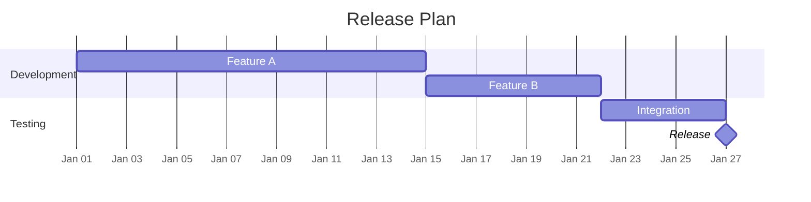

Key syntax:

- `dateFormat` controls input parsing; `axisFormat` controls display
- Task references: `after taskId` for dependencies
- `:milestone` for zero-duration markers
- `:active`, `:done`, `:crit` for task styling

## Pie Chart

Proportional breakdowns and distribution visualizations.

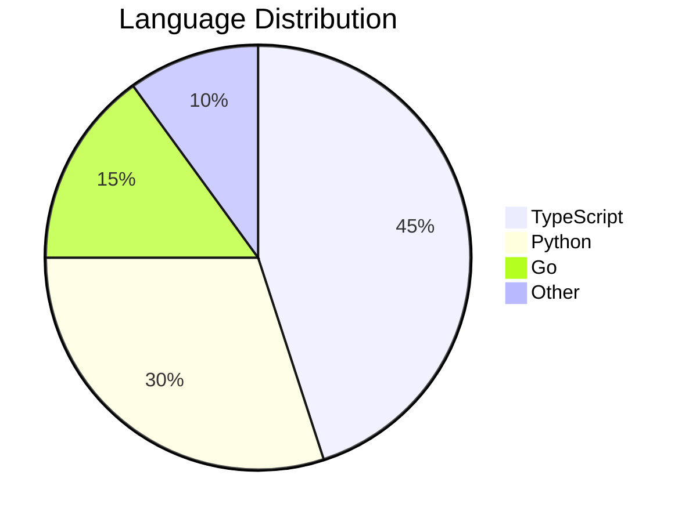

Key syntax:

- Values are proportional; they do not need to sum to 100.
- Always quote labels to avoid parsing issues.

## Mindmap

Topic hierarchies, brainstorming, and concept maps.

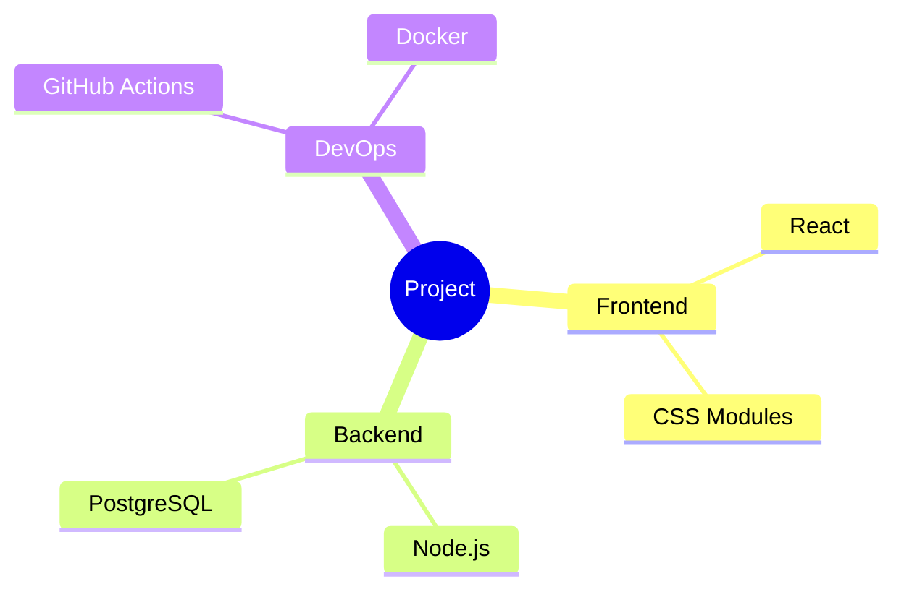

Key syntax:

- Indentation defines the tree structure (2 or 4 spaces).
- Root node shape: `(())` circle, `[]` square, `()` rounded.
- Leaf nodes are plain text at indentation level.

## Timeline

Chronological events, milestones, and release history.

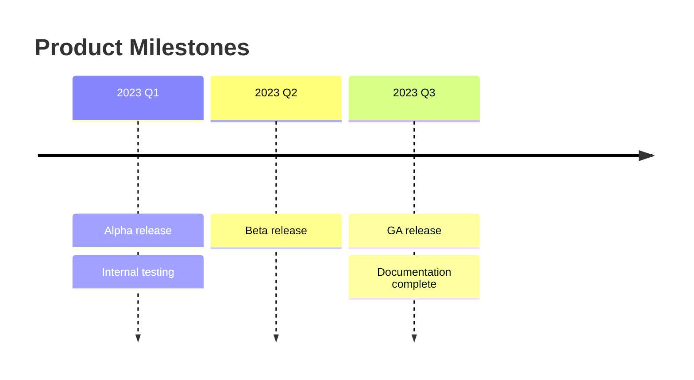

Key syntax:

- Each time period is followed by `: event` entries.
- Multiple events per period are listed on separate lines with `:` prefix.

## Gitgraph

Branch strategies and merge workflows.

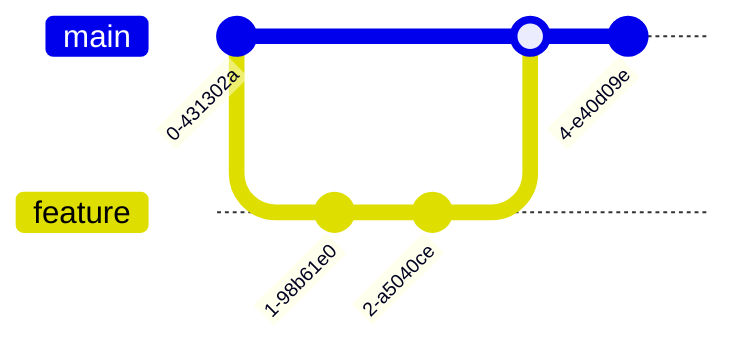

Key syntax:

- `commit` adds a commit to the current branch
- `branch name` / `checkout name` / `merge name` for branch operations
- `commit id: "msg"` to label specific commits

## Quadrant Chart

Priority matrices and categorization grids.

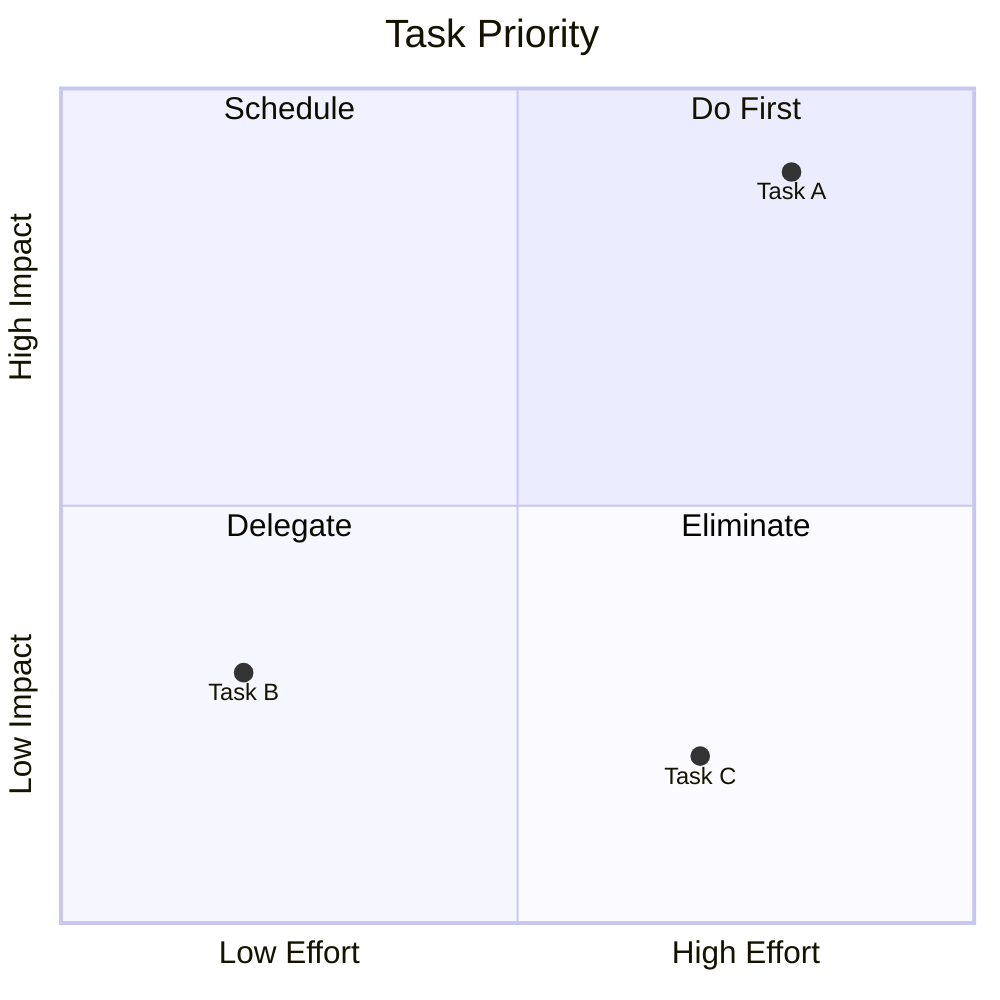

Key syntax:

- Coordinates are `[x, y]` in the range `[0, 1]`.
- `quadrant-1` is top-right, numbering goes counter-clockwise.

## XY Chart (Beta)

Line and bar charts with numeric axes.

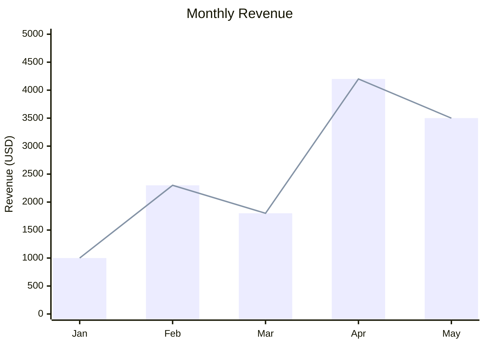

Key syntax:

- `x-axis` accepts a label array or numeric range.
- `bar` and `line` accept data arrays of the same length as x-axis.

## Sankey Diagram (Beta)

Flow quantities and resource allocation.

```text
sankey-beta

Source A,Target X,50
Source A,Target Y,30
Source B,Target X,20
Source B,Target Y,40
```

Key syntax:

- CSV format: `source,target,value` (one flow per line).
- Values must be positive numbers.
- Rendered as a Sankey flow diagram; note this is a `beta` type.

## Block Diagram (Beta)

System block diagrams and architecture boxes.

```text
block-beta
    columns 3
    A["Service A"]:1
    B["Service B"]:1
    C["Service C"]:1
    D["Load Balancer"]:3
    D --> A
    D --> B
    D --> C
```

Key syntax:

- `columns N` sets the grid width.
- `name:span` sets how many columns a block spans.

## Architecture Diagram (Beta)

Cloud architecture and service topology.

```text
architecture-beta
    group cloud(cloud)[Cloud Provider]

    service api(server)[API] in cloud
    service db(database)[Database] in cloud
    service cache(server)[Cache] in cloud

    api:R --> L:db
    api:B --> T:cache
```

Key syntax:

- `group name(icon)[Label]` for grouping.
- `service name(icon)[Label] in group` for placing services.
- Edge direction uses compass points: `T` top, `B` bottom, `L` left, `R` right.
