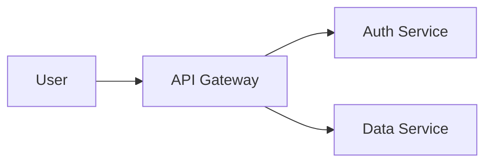

# Project Documentation

## Objective

Produce clear, consistently formatted Markdown documentation that is easy to navigate, lint-clean on first commit, and visually useful with diagrams where appropriate. All project documentation uses Markdown unless a specific tooling requirement dictates otherwise.

## Scope

**In-scope:**

- Markdown file naming and placement
- Content structure and heading hierarchy
- Code fence formatting and nesting
- Mermaid diagram authoring
- Table, list, and link conventions
- Markdown linting with markdownlint-cli2
- README and root-level document standards
- docs/ directory organization

**Out-of-scope:**

- Static site generator configuration (MkDocs, Docusaurus, Jekyll)
- API documentation generation tools (Swagger, TypeDoc)
- Non-Markdown formats (reStructuredText, AsciiDoc)
- Content translation or localization

## File Naming

Two naming rules apply to all Markdown files:

1. **Fixed uppercase names**: Standard project-entry documents use fixed uppercase names. These are the only Markdown files allowed at the repository root.
    - `README.md`
    - `CHANGELOG.md`
    - `CONTRIBUTING.md`
    - `SECURITY.md`
    - `CODE_OF_CONDUCT.md`

2. **Lowercase-kebab-case**: All other Markdown files use lowercase-kebab-case (e.g., `getting-started.md`, `error-handling.md`, `release-process.md`).

Exceptions:

- `index.md` is allowed when required by documentation tooling.
- `README.md` is allowed in subdirectories when ecosystem conventions require it (e.g., package-level READMEs in monorepos).

## File Placement

### Root Level

Only the fixed uppercase Markdown files listed above belong at the repository root. Do not place any other documentation files at root.

- **README.md** (required): Project overview, getting started, basic usage, and navigation to deeper documentation.
- **CHANGELOG.md** (optional): Version history and release notes.
- **CONTRIBUTING.md** (optional): Contribution guidelines, code style, PR process. May alternatively live in `docs/`.
- **SECURITY.md** (optional): Security policy and vulnerability reporting.
- **CODE_OF_CONDUCT.md** (optional): Community conduct expectations.

### docs/ Directory

All other project documentation lives under `docs/`. Organize files into topic-based subdirectories rather than placing them flat in `docs/`.

Standard subdirectories:

| Directory               | Purpose                                                   |
| ----------------------- | --------------------------------------------------------- |
| `docs/guides/`          | How-to guides, tutorials, getting-started walkthroughs    |
| `docs/api/`             | API reference documentation                               |
| `docs/architecture/`    | System design, component diagrams, high-level overview    |
| `docs/decisions/`       | Architecture decision records (ADRs) and design rationale |
| `docs/examples/`        | Sample code and usage patterns                            |
| `docs/troubleshooting/` | Common issues and solutions                               |

Create additional subdirectories when a project's documentation does not fit these categories. Name them in lowercase-kebab-case.

## Content Structure

Every Markdown documentation file follows this structure:

### 1. Title

Start with a single `# Heading` that names the document's subject. One `#` heading per file.

### 2. Overview

A brief paragraph (2-4 sentences) immediately after the title stating what this document covers and who it is for. The reader decides whether to continue based on this paragraph.

### 3. Body

Organize the body with `##` and `###` headings. Do not skip heading levels (e.g., do not jump from `##` to `####`).

- **One topic per section.** Each `##` section covers a single concept, procedure, or reference item.
- **Use lists over prose.** Bullet points and numbered lists are easier to scan than paragraphs.
- **Use numbered lists for sequential steps.** When order matters, number the steps.
- **Use tables for structured comparisons.** When presenting options, configurations, or field definitions, use Markdown tables.
- **Link to related docs.** Use relative links to other documentation files rather than duplicating content.

### 4. Examples

Include at least one concrete example when the document describes a procedure, configuration, or API. Place examples inline or in a dedicated `## Examples` section at the end.

## Code Fences

Always use backtick fences for code blocks. Never use tilde fences.

**Rules:**

- Use triple backticks (`` ``` ``) for all standard code blocks.
- Specify the language identifier after the opening fence when the language is known (e.g., `` ```bash ``, `` ```typescript ``, `` ```json ``). Omit the identifier only when the content has no specific language.
- When a code block contains inner triple-backtick fences (e.g., showing a Markdown example that itself contains code), use four backticks (```` ```` ````) for the outer fence.
- Do not indent fenced code blocks with spaces or tabs outside the fence. Indented code blocks are harder to maintain and lint.

## Mermaid Diagrams

Use Mermaid diagrams to visualize architecture, workflows, state machines, and relationships directly in Markdown. Mermaid renders natively in GitHub, GitLab, and most documentation platforms.

### When to Use Mermaid

- **Architecture**: Component relationships, service dependencies, deployment topology
- **Workflows**: CI/CD pipelines, user flows, approval processes
- **State machines**: Object lifecycle, feature flags, connection states
- **Sequences**: API call flows, authentication handshakes, event chains
- **Entity relationships**: Data models, schema diagrams

### Syntax

Open a fenced code block with the language identifier `mermaid`:

````markdown

````

### Diagram Guidelines

- Keep diagrams focused. One diagram per concept. If a diagram exceeds ~15 nodes, split it.
- Use descriptive node labels, not single letters: `Auth Service` not `A`.
- Add a brief text description before or after the diagram for accessibility and for rendering environments that do not support Mermaid.
- Prefer `graph LR` (left-to-right) for pipelines and flows. Use `graph TD` (top-down) for hierarchies.
- Use `sequenceDiagram` for request/response flows between named participants.
- Use `stateDiagram-v2` for lifecycle and state transition diagrams.

## Tables

- Align columns using the pipe-and-dash syntax. Leading and trailing pipes are required.
- Left-align text columns. Right-align numeric columns using `:---` and `---:` syntax.
- Keep tables concise. If a table exceeds ~8 columns, consider splitting or restructuring.
- Do not use HTML tables in Markdown files.

## Links

- Use relative paths for links to other files in the same repository: `[Setup guide](./docs/guides/setup.md)`.
- Use absolute URLs only for external resources.
- Anchor links to headings within the same file: `[See constraints](#constraints)`.
- Avoid bare URLs in prose. Wrap them in angle brackets or use named links.

## Linting

Lint all Markdown files with [markdownlint-cli2](https://github.com/DavidAnson/markdownlint-cli2) before committing.

### Running the Linter

```bash
npx --yes markdownlint-cli2 <files-or-globs>
```

If the project has a `.markdownlint-cli2.jsonc` config file, the linter uses it automatically. Otherwise, all default rules apply.

### Common Rule Adjustments

Projects may customize rules in `.markdownlint-cli2.jsonc`:

| Rule  | Default              | Common override                                    |
| ----- | -------------------- | -------------------------------------------------- |
| MD013 | Line length ≤ 80     | Disable for prose-heavy docs                       |
| MD010 | No hard tabs         | Allow tabs in code blocks for shell scripts        |
| MD026 | No punctuation in headings | Allow `:` for label-style headings            |
| MD036 | No emphasis as heading | Allow bold-as-heading in checklist content        |
| MD040 | Require language on fences | Disable when language is ambiguous             |
| MD048 | Consistent fence style | Set to `backtick` to enforce backtick-only fences |

### Linting Workflow

1. Run the linter after writing or editing any Markdown file.
2. Fix all reported violations before committing.
3. If a rule conflicts with the project's documentation style, add an override to the markdownlint config file rather than ignoring the violation.

## Constraints

**MUST:**

- Use Markdown for all project documentation.
- Apply the fixed uppercase / lowercase-kebab-case naming split described above.
- Place only the fixed uppercase files at the repository root; all others under `docs/`.
- Start every documentation file with a single `#` heading.
- Include an overview paragraph after the title.
- Use backtick fences for all code blocks. Never use tilde fences.
- Use four-backtick outer fences when inner triple-backtick fences exist.
- Run markdownlint-cli2 and resolve all violations before committing.

**MUST NOT:**

- Use spaces, mixed case, or snake_case in non-standard Markdown file names.
- Place ad hoc documentation files at the repository root.
- Scatter documentation across multiple directories without a centralized `docs/` location.
- Use multiple `#` headings in a single file.
- Skip heading levels (e.g., `##` followed by `####`).
- Use HTML for formatting that Markdown can express natively (tables, emphasis, headings).

**MAY:**

- Nest subdirectories within `docs/` beyond the standard set (e.g., `docs/guides/advanced/`).
- Use `index.md` within documentation subdirectories when required by tooling.
- Place `CONTRIBUTING.md` in `docs/` instead of root if preferred.
- Include Mermaid diagrams for any concept that benefits from visual representation.
